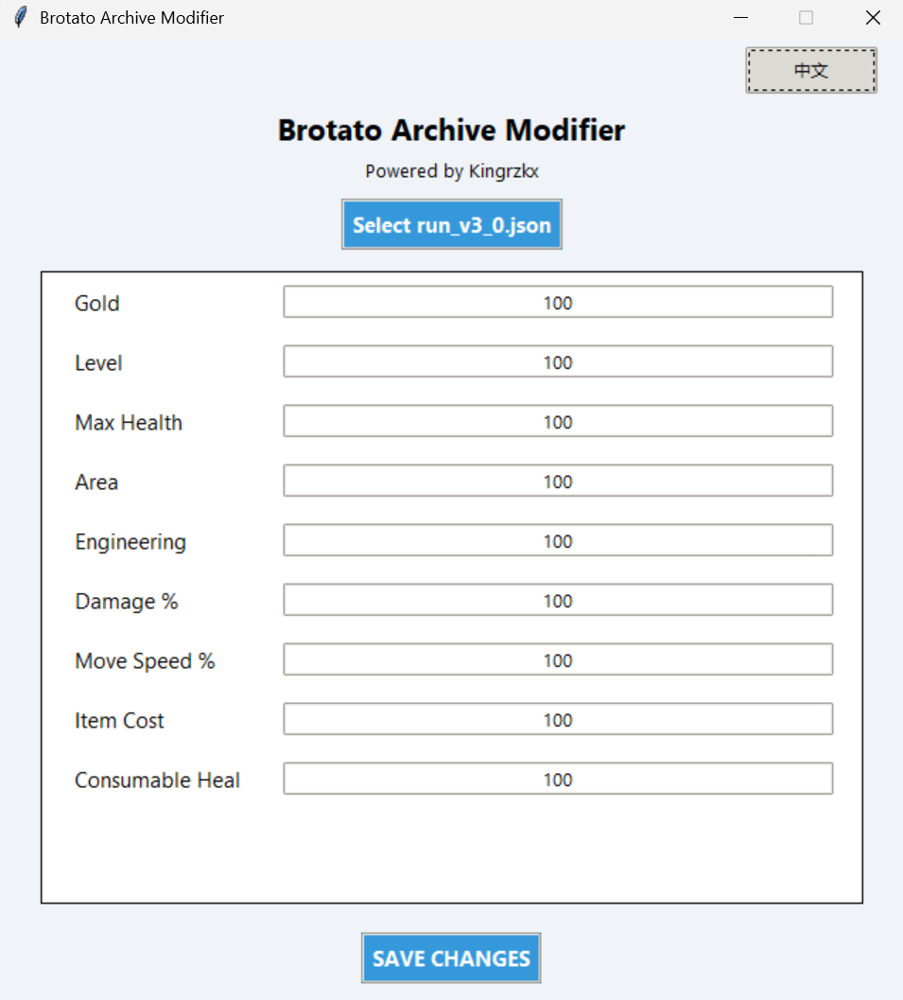
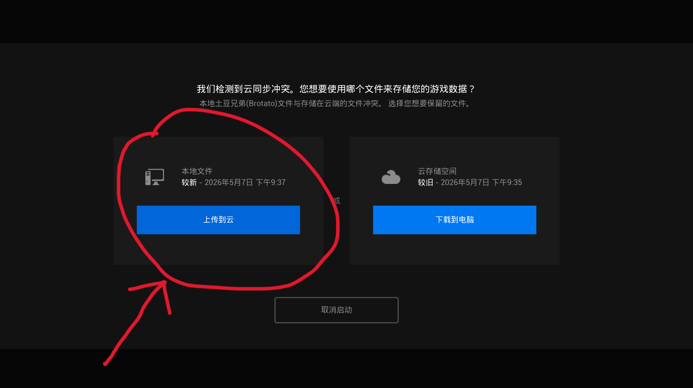

# Brotato Archive Modifier ✅
**Powered by kingrzkx**

Clean, bilingual save editor for Brotato (v1.1.14.6 compatible).

---

## ✨ Features
- 🌍 CN/EN bilingual UI
- 🎯 1:1 stat matching
- 🎨 Modern & minimal design
- 🚀 Single `.exe` release

---

## 📦 Supported Attributes
- Gold
- Level
- Max Health
- Area
- Engineering
- Damage %
- Move Speed %
- Item Cost
- Consumable Heal

---

## 📸 Preview
| Program UI | Save Conflict Prompt |
|------------|---------------------|
|  |  |

---

## 🚀 How to Use
1. Launch Brotato (v1.1.14.6), complete the first wave and save your progress.
2. Fully exit the game.
3. Run `BrotatoArchiveModifier.exe`.
4. Select your `run_v3_0.json` save file.
5. Modify values as needed.
6. Save changes.
7. Fully close the modifier.
8. Launch Brotato again.
9. If a save conflict prompt appears, choose **Upload local save to cloud**.
10. Enjoy your modified game!

---
## 💡 Save Path Tip
Default save location:
C:\Users\yourusername\AppData\Roaming\Brotato\somenumbers(example 8c882a6d.............)\run_v3_0.json

---

## 📄 License
MIT © kingrzkx
